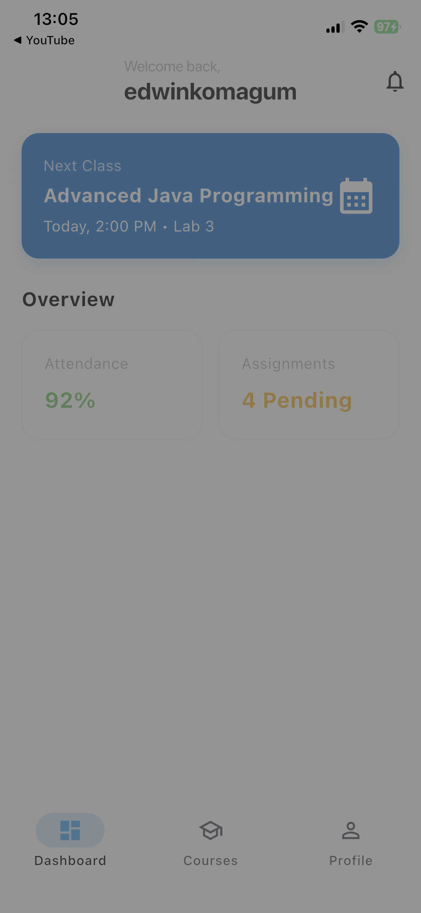
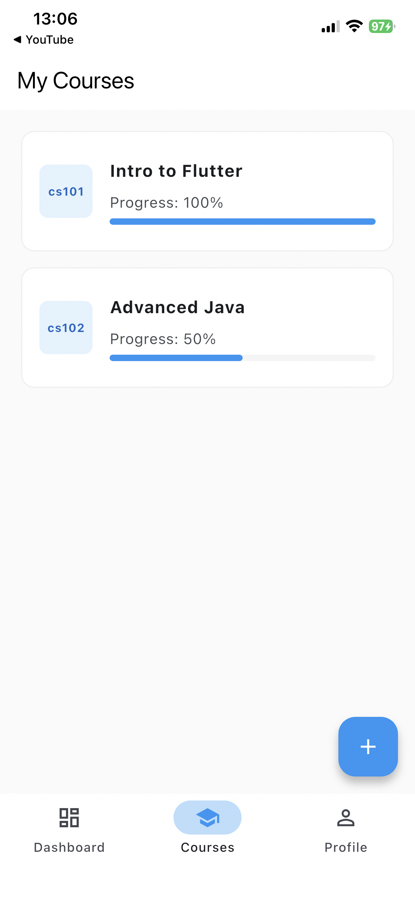

# EduLink - Mobile Learning Management System

A full-stack mobile application built with **Flutter** and **Firebase** that allows users to enroll in courses, watch video lessons, track their progress, and manage their student profile.

Designed and built by **Edwin Komagum**.

---

## Screenshots

| Home Screen | Course Details | Video Player | Profile |
|:---:|:---:|:---:|:---:|
|  |  |  |  |

*(Note: Screenshots demonstrate the iOS implementation running on iPhone 12)*

---

## Key Features

* **Secure Authentication:** Email/Password login and registration using Firebase Auth.
* **Dynamic Content:** Courses and lessons are fetched in real-time from Cloud Firestore.
* **Video Integration:** Integrated YouTube player for seamless lesson playback inside the app.
* **Progress Tracking:** Interactive checkboxes that auto-calculate and update course completion status (0-100%).
* **Profile Management:** Users can upload profile pictures directly from their device gallery to Firebase Storage.
* **Cloud Sync:** All data (progress, user details, courses) is synced across devices.

---

## 🛠️ Tech Stack

* **Frontend:** Flutter (Dart)
* **Backend:** Firebase (Baas)
* **Database:** Cloud Firestore (NoSQL)
* **Storage:** Firebase Storage (Image hosting)
* **State Management:** Native `setState` & StreamBuilders for real-time updates.

---

## ⚙️ Installation & Setup

This project uses Firebase. To run it locally, you will need your own `google-services.json` (Android) or `GoogleService-Info.plist` (iOS).

1.  **Clone the repo:**
    ```bash
    git clone https://github.com/edwin-ug/Edulink_app.git
    ```

2.  **Install Dependencies:**
    ```bash
    flutter pub get
    ```

3.  **Run the App:**
    ```bash
    flutter run
    ```

---

## 🤝 Contact

**Edwin Komagum** Software Engineering Major | Mobile App Developer  
[GitHub Profile](https://github.com/edwin-ug)
